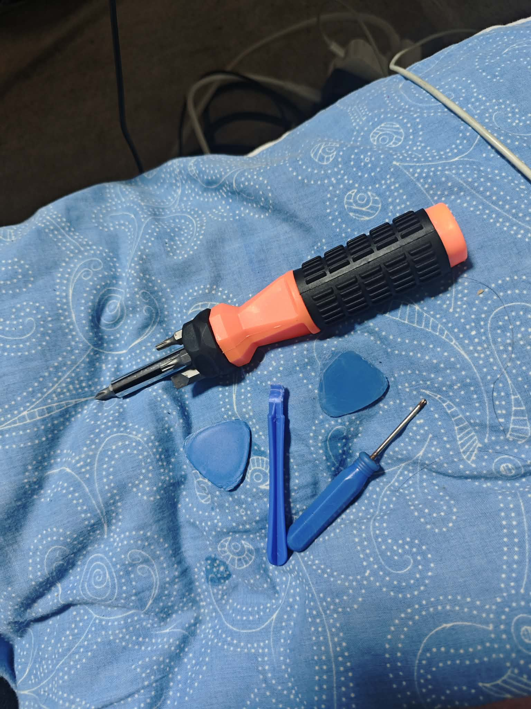

# Legacy Laptop Modernization & Performance Restoration

Optimizing systems by resolving Disk Overutilization, Hardware Bottlenecks, and Battery degradation.

# Laptop Model & Specs

## Acer Aspire E5-575G (2016 model)
* Processor: Intel Core i3-6100U (Dual-core, 2.30 GHz)
* Original RAM: 4 GB DDR4-2133 MHz
* Original Storage: 500 GB (5400 RPM mechanical drive)

# Overview

* This project involved the diagnostic troubleshooting and hardware overhaul of a 9-year-old "legacy" laptop. 
* The primary goal was to resolve severe performance bottleneck, Battery replacement and extend the machine's functional lifespan. 
* By performing a clean installation of Windows 10 onto a Solid State Drive and upgrading the ram triple it's size.

# Skills demonstrated in this project

# Hardware & Engineering Skills
* Component Level Troubleshooting: Identified the "bottleneck" (HDD) and selected the correct parts (SSD/RAM) to fix it.
* Precision Disassembly: Utilized specialized tools to open a chassis without breaking plastic clips or stripping screws.
* ESD (Electrostatic Discharge) Safety: Handled sensitive "green board" components and RAM chips correctly to avoid frying them with static.
* Hardware Interfacing: Executed precise installation of SATA-based solid-state storage and matched-pair DDR4 RAM modules for maximum performance.
* Power Management: Swapped an internal battery, which involves managing delicate motherboard ribbon cables.
  
# Systems & Software Skills
* BIOS/UEFI Configuration: Managed BIOS/UEFI parameters to optimize the boot sequence and facilitate installation from external recovery media.
* OS Deployment: Primarily used RUFUS to create "bootable media" into the USB and performed a clean installation of Windows 10.
* Driver Management: Confirmed the laptop was running smoothly by updating the system and checking that all new parts were working perfectly with Windows.
* Demonstrated sustainability skills by repairing a "legacy" unit instead of contributing to e-waste by buying a new one.

# Lab Walkthrough

### Phase 1: Files Back up / Diagnosing System Issue

# Step: 1 Task Manager shows 100% Disk Usage 
* The system is experiencing a performance bottleneck, characterized by significant latency in web browsing and application response times, independent of available disk storage.
* Despite ample free disk space, the user interface remains unresponsive and slow.

# Step: 2 Before changing storage disk make sure to backup your files
Here in my case i used External SSD to backup my files.

### Phase 2: Hardware Troubleshooting

# Tools used for this Project

* Multi-bit Precision Screwdriver
* Plastic Spudger (Prying Tool)
* Opening Picks (Plectrums)
* Small Precision Screwdriver

  

# Step: 1 Removing screws on the back case

# Step: 2 Case on HDD and Ram slots are exposed

# Step: 3 Ram slot shows it only has 4gb inside.

# Step: 4 Placing both 4gb ram and 8gb ram. 
Checked the compatibility of rams and confirmed it is both DDR4.

# Step: 5 Replacing the Hard Disk Drive with Solid State Drive

# Step: 6 New SSD and Ram Slots are inserted into the board.

# Step: 7 Replacing Internal Battery

# Step: 8 Testing if the new battery will power on the laptop and it worked.

### Phase 3: Internal Diagnostics

# Step: 1 Checking Bios if SSD was detected 

# Step: 2 Searching for bootloader

# Step: 3 Downloaded Win 10.iso in another pc and created a boot loader in an External USB

# Step: 4 Windows 10 Operating System Deployment

# Phase 4: Final Implementation & Results

# Step: 1 Checking the battery.

# Step: 2

# Project Results
* Improved the laptop's storage from 500gb HDD to 500gb SSD resulting in faster boot ups and faster navigation of files.
* Upgraded 4gb ram into 12gb ram to be able to perform daily tasks
* User feedback has confirmed that the previous sluggishness and input lags have been completely resolved.
* Cost of upgrades worth 142$ in total for all the parts replaced.

# Security & Compliance
​* Retained the original HDD as a secure offline backup, ensuring no data loss during the transition to SSD.
​* Performed a clean OS installation using official Windows 10 media with Secure Boot enabled to prevent unauthorized bootloaders.
​* Adhered to ESD (Electrostatic Discharge) protocols during disassembly to protect internal circuitry from static damage.
​* Extended the hardware lifecycle by 3–5 years, reducing e-waste through component-level restoration rather than replacement.

# Technical & System Restoration
​* Identifying and resolving hardware bottlenecks, specifically the transition from mechanical (HDD) to flash-based (SSD) storage.
​* Gained hands-on experience in expanding system volatile memory and understanding the performance impact of multi-channel RAM configurations.
​* Successfully executed a clean Windows 10 installation using bootable media (Rufus), including driver initialization and BIOS/UEFI configuration.
​
# Hardware Engineering & Safety
​* Developed skills in non-destructive disassembly and internal component replacement (Battery/SSD/RAM) within compact laptop chassis.
​* Applied professional Electrostatic Discharge safety standards to prevent latent damage to sensitive motherboard circuitry.
​

# Relevant for roles such as:

* IT Support Technician
* Desktop Support
* Jr System Administrator
